# Robot Button Mapping

Source of truth: [RobotContainer.java](/Users/godbrigero/Documents/2026Rebuilt/src/main/java/frc/robot/RobotContainer.java)

This visualization reflects the current bindings in `RobotContainer`. It includes both direct button bindings and the analog inputs used by default commands.

## Visual Map

```mermaid
flowchart TB
  subgraph LS["Left Flight Stick (USB 2)"]
    LS_ROT["Twist / rotation axis"] --> DRIVE_ROT["Swerve rotation command"]
    LS_B5["B5 press"] --> GPS_TOGGLE["Toggle swerve GPS assist"]
  end

  subgraph RS["Right Flight Stick (USB 3)"]
    RS_Y["Joystick Y axis"] --> DRIVE_X["Swerve X translation"]
    RS_X["Joystick X axis"] --> DRIVE_Y["Swerve Y translation"]
    RS_B5["B5 press"] --> RESET_DRIVER["Reset driver-relative swerve heading"]
    RS_B17["B17 hold"] --> EXTAKE["Override intake to extake"]
    RS_SLIDER["Right slider"] --> MANUAL_SHOOT["Manual shooter speed setpoint"]
  end

  subgraph OP["Operator Panel (USB 1)"]
    OP_BLACK["Black button hold"] --> RESET_GLOBAL["Continuously align unified gyro to global pose"]
    OP_GREEN["Green button press"] --> GPS_AIM["Toggle turret + shooter GPS assist"]
    OP_WHEEL["Wheel axis"] --> MANUAL_AIM["Manual turret aim when GPS assist is off"]
    OP_TOGGLE_MID["Toggle wheel middle"] --> INTAKE_TOP["Set intake idle wrist position to TOP"]
    OP_TOGGLE_MIDDOWN["Toggle wheel mid-down"] --> INTAKE_MID["Set intake idle wrist position to MIDDLE"]
    OP_METAL["Metal switch down"] --> SHOOT_ENABLE["Enable shooting command"]
    OP_METAL --> INTAKE_ENABLE["Lower intake wrist and run intake"]
    OP_METAL -. switch up .-> BASE_SPEED["Shooter idles at base speed"]
  end

  GPS_TOGGLE --> DRIVE_MODE["Field-relative swerve with optional lane assist"]
  DRIVE_X --> DRIVE_MODE
  DRIVE_Y --> DRIVE_MODE
  DRIVE_ROT --> DRIVE_MODE

  GPS_AIM --> TURRET_MODE["Turret default: auto aim or manual wheel aim"]
  GPS_AIM --> SHOOT_MODE["Shooter while metal switch is down: auto target or manual speed"]
  MANUAL_AIM --> TURRET_MODE
  MANUAL_SHOOT --> SHOOT_MODE
  SHOOT_ENABLE --> SHOOT_MODE
  INTAKE_ENABLE --> INTAKE_MODE["Intake default command"]
  EXTAKE --> INTAKE_MODE
```

## Binding Table

| Control | Type | Behavior |
| --- | --- | --- |
| Left flight stick twist | Analog | Commands swerve rotation |
| Left flight stick `B5` | Press | Toggles swerve GPS assist / lane-assist features |
| Right flight stick X | Analog | Commands swerve Y translation |
| Right flight stick Y | Analog | Commands swerve X translation |
| Right flight stick `B5` | Press | Resets driver-relative swerve heading |
| Right flight stick `B17` | Hold | Forces intake to extake instead of intake |
| Right flight stick slider | Analog | Sets manual shooter velocity when shooter GPS assist is off |
| Operator panel wheel | Analog | Manual turret target when turret GPS assist is off |
| Operator panel green button | Press | Toggles turret GPS assist and shooter GPS assist; cancels current turret/shooter command so defaults restart in the new mode |
| Operator panel black button | Hold | Repeatedly resets unified gyro rotation to the current global pose heading |
| Operator panel toggle wheel middle | Press | Sets the intake idle wrist position to `TOP` |
| Operator panel toggle wheel mid-down | Press | Sets the intake idle wrist position to `MIDDLE` |
| Operator panel metal switch down | Hold state | Enables shooter command and also drives intake behavior |
| Operator panel metal switch up | Hold state | Shooter runs base speed instead of the active shooting command |

## Command-Level Behavior

### Drivetrain

| Inputs | Result |
| --- | --- |
| Left stick twist + right stick X/Y | Default teleop swerve driving |
| Left stick `B5` | Enables/disables GPS-assisted lane adjustment inside swerve teleop |
| Right stick `B5` | Re-zeros the driver-relative reference heading |
| Operator panel black button | Resets full gyro heading from global position while held |

### Turret

| Condition | Active behavior |
| --- | --- |
| Turret GPS assist enabled | `ContinuousAimCommand` aims at `AimPoint.getTarget()` |
| Turret GPS assist disabled | `ManualAimCommand` maps the operator wheel to turret position |
| Operator panel green button | Toggles between those two modes |

### Shooter

| Condition | Active behavior |
| --- | --- |
| Metal switch down + shooter GPS assist enabled | `ContinuousShooter` uses `AimPoint.getTarget()` |
| Metal switch down + shooter GPS assist disabled | `ContinuousManualShooter` uses the right-stick slider for shooter speed |
| Metal switch up | Shooter falls back to base speed |
| Operator panel green button | Toggles shooter GPS assist mode |

### Intake

| Condition | Active behavior |
| --- | --- |
| Metal switch down | Intake wrist moves to bottom and intake motor runs |
| Metal switch up | Intake motor stops and intake wrist moves to the currently selected idle raise location |
| Right stick `B17` while intake is active | Intake motor reverses to extake |
| Operator panel toggle wheel middle | Changes the idle raise location to `TOP` |
| Operator panel toggle wheel mid-down | Changes the idle raise location to `MIDDLE` |

## Notes

| Item | Detail |
| --- | --- |
| Shared switch | The operator panel metal switch affects both shooter and intake behavior |
| Intake idle state | Intake defaults to `MIDDLE` when not active until changed by a toggle wheel binding |
| Climber | No climber bindings are currently implemented in `RobotContainer` |
| Autonomous named commands | `ContinuousAimCommand`, `IntakeCommand`, and `ContinuousShooterCommand` are also registered for PathPlanner autos, but they are not direct driver controls |
